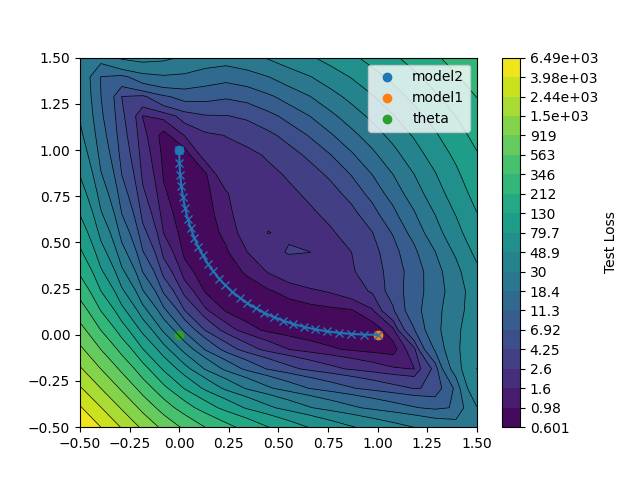
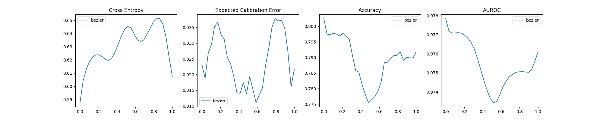

# Mode-connectivity in loss landscape
This repo is my implementation of the mode-connectivity result in [1](#ref-1). The paper posits that any two local minima in the loss landscape can be connected by a curve through a valley in the loss landscape. Apart from the interesting fact that this is possible, the result can also be used for quick ensemble sampling for uncertainty quantification. 

## Key idea
Assume that we have a class of models $\mathcal M$, parametrized by parameters $w \in \mathbb R^n$. Then the paper posits that two neural networks parametrised with $w_1$ and $w_2$, which both are local minimas of the loss function, can be connected by a simple path, which maintain the same minimal loss.

In the paper, the path is parametrized as a chain of two straight lines that both connect to a third parameter set $\theta$:

$$
\phi_{\theta}(t)=
\begin{cases}
2\left(t\theta + (0.5 - t)w_1\right), & 0 \le t \le 0.5 \\
2\left((t - 0.5)w_2 + (1 - t)\theta\right), & 0.5 \le t \le 1
\end{cases}
$$


Or as I have done in this implementation, the path is parameterized as a bezier curve connecting the start and end points:

$$
\phi_{\theta}(t) = (1-t)^2w_1 + 2t(1-t)\theta + t^2w_2
$$

Given that the two end-point models parametrized by $w_1$ and $w_2$ has been trained and reached local minimas, the curve-model parametrized by $\phi_{\theta}(t)$ is trained by minimizing the expectation over a uniform distribution on the curve:

$$
\ell(\theta) = \underset{t\sim U(0,1)}{\mathbb E}[\mathcal L(\phi_{\theta}(t))]
$$

where $\mathcal L$ is the loss at a single model instance.

The loss is minimized by first sampling $t\sim U(0,1)$ and then generating the model $\phi_{\theta}(t)$ in terms of the tuple $(t, \theta, w_1, w_2)$ by using Pytorch' reparametrization functionality. Then the gradient 
$\nabla_\theta\mathcal L(\phi_{\theta}(t))$ can be calculated and finally a gradient step can be taken.


## Results
The following results are created with `CIFAR_experiment.ipynb`, but can also be reproduced using the standard setting for `modeconnectivity.py` as described below. CIFAR10 data has been used for this particular experiment. The model used is a pretty standard convolutional neural network with 3 convolutional layers and two linear layers, ReLU activation and 50% dropout. See [models.py](modeconnectivity/models.py) for further details.

The code first trains the start and end models, and next the $\theta$-model is trained. 
### Loss landscape
The loss landscape, projected unto the plane suspended by the beziercurve is plottet below. Note that the landscape is squeezed such that $w_1$ is mapped to (1,0), $w_2$ is mapped to (0,1) and $\theta$ is mapped to (0,0). 


It can indeed be seen that the curve lies in a valley as posited in the paper. 
### Performance metrics along the curve
Given that $\theta$ is now fixed, the performance along the curve can be investigated. In the following plot, several performance measures are plotted as function of time $t$. First the Cross Entropy, which is also the loss used for training. Note that the Cross Entropy loss is a slighty bit higher in the inner part of the curve, than at the endpoints. That is reasonable, since the endpoints have been trained freely, whereas the curve is optimized along its full length. However, the difference between the inner parts of the curve and the endpoints is not very large compared to the difference between the endpoints. With regards to the accuracy, the models sampled along the curve are actually *better* than the ones at the endpoints.


### Ensemble prediction
Finally, the question is: What if use parameter sets sampled along the curve as ensembles? In the normal setup for a classification task, the model would predict logits $\hat{z} = p_{w}(x)$, which would then be turned into probabilites for each class: 

$$
\hat{y} = \text{softmax}(\hat z).
$$

Instead, in ensemble prediction we use the sampled parameter sets and average over the output: 

$$
\hat z = \frac{1}{K}\sum_i^K p_{\phi_{\theta}(t)}(x)
$$

The idea is that the parameter samples $\phi_{\theta}(t)$ where $t\in U(0,1)$ should estimate the Bayesian posterior distribution roughly. Ok... very rough approximation, but still. 

This results in a more robust model. Below is a table with the evaluation of the Cross Entropy loss, the Expected Calibration Error (ECE), the Accuracy and the Area Under the Reciever-Operator Curve (AUROC), for the start model, the end model and for the ensemble of models along the curve.

As can be seen, all measurements except the ECE improve when using the ensemble of models. The ECE is probably higher since the ensemble inevitably gives more conservative predictions than the start and end models - in the sense that the ensemble is less sure about its predictions.  

| Model       |   Cross Entropy |   Expected Calibration Error |   Accuracy |    AUROC |
|:------------|----------------:|-----------------------------:|-----------:|---------:|
| Start model |        0.587726 |                    0.0231762 |     0.8025 | 0.977849 |
| End model   |        0.607342 |                    0.0216215 |     0.7918 | 0.976107 |
| Ensemble    |        0.544668 |                    0.0373571 |     0.8158 | 0.98081  |


## How to run

Create a virtual environment and install the packages:
```
python -m pip install -e .
```
Then the code can be run with the standard settings with
```
cd modeconnectivity
python3 modeconnectivity.py
```
## Repo layout


```
mode-connectivity/
├── LICENSE
├── README.md
├── requirements.txt
├── experiments/
│   └── results_notebook_CIFAR/
│       ├── curve_model/
│       ├── end_model/
│       ├── figures/
│       ├── logs/
│       ├── models/
│       └── start_model/
└── modeconnectivity/
	├── CIFAR_experiment.ipynb
	├── curve_eval.py
	├── curve_model.py
	├── curve_plots.py
	├── function_experiment.ipynb
	├── modeconnectivity.py
	├── models.py
	├── scheduler.py
	└── train.py
```

- `LICENSE`: License for the project.
- `README.md`: Project overview, results, and usage instructions.
- `requirements.txt`: Python dependencies.
- `experiments/`: Saved outputs from runs (models, logs, plots, and artifacts).
- `modeconnectivity/`: Core source code for training, curve optimization, evaluation, and plotting.
	- `CIFAR_experiment.ipynb`: Runs main experiment and makes plots for this readme.
	- `curve_model.py`: The Curve class implements the parameter reparametrization.
	- `curve_eval.py`: Evaluation utilities for models along the curve.
	- `curve_plots.py`: Plotting utilities for landscapes and curve metrics.
	- `function_experiment.ipynb`: Experiment showing that for small models, the result does not hold.
	- `modeconnectivity.py`: Main script to train endpoint models and fit the curve model.
	- `models.py`: Model architectures used in experiments.
	- `scheduler.py`: Learning-rate scheduling logic and optimizer definition.
	- `train.py`: Standard model training routines.


## References

1. <a id="ref-1"></a> Timur Garipov, Pavel Izmailov, Dmitrii Podoprikhin, Dmitry Vetrov, and Andrew Gordon Wilson. 2018. Loss surfaces, mode connectivity, and fast ensembling of DNNs. In Proceedings of the 32nd International Conference on Neural Information Processing Systems (NIPS'18). Curran Associates Inc., Red Hook, NY, USA, 8803–8812. https://arxiv.org/pdf/1802.10026
